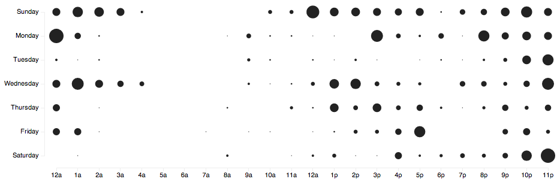

# Do programmers work at night?

Before I can go on, we should first agree whether programmers do in fact work at night or is this just some myth perpetuated by male bravado and our romantic notions of a motivated person doing magic all night. Perhaps we just value exceptionally hard work and working all night is a way of proving you are exceptionally motivated and awesome.

To research this book I talked to some ten programmers and read hundreds of comments on the original essay, Twitter and various Reddit threads about the topic. Essentially, yes, programmers do work at night. They are the loud ones, the romantic young lads and lasses who feel night is the only place to work.

But a large portion of the programmer population is also completely baffled by this. Claiming that those working at night simply cannot schedule their lives, have no familial obligations or simply don't understand how spectacular starting your day in the morning can be.

A large part of this divide, I think, is simply that **it depends**. The core reasons for _why_ we work at night, or very early in the morning, or lucked out on a conductive day-time environment appear the same and mostly have to do with deep thought, flow and focus on one's work.

Another venue worth exploring is whether our perceptions might not match reality at all. For instance, I was certain that 1am was when I reached peak productivity and could get the most done. But looking at timestamps of my Github commits on various projects shows that I am much less a night coder than I am a late afternoon and evening kind of guy.

Then again, most adults working day jobs would find it incredibly odd that I should get the majority of my work done from 10pm to midnight. My habit of "doing email" at midnight also confuses many.

## It depends

Generally speaking, programmers do seem to work at night - just take a moment to look around the internet. Plenty of advice on stimulants, romanticizing late nights and infinite bravado about how little sleep everyone needs to function.

Talking to individual programmers reveals a different picture. Many will admit to working mostly during the day, at worst late in the afternoon. Infinite amounts of people admitting they hate working at night and mostly do it when they have to chase a deadline or two.

The one dividing factor between the two groups seems to be age. Not so much because age has anything to do with it (although it does dictate our sleep-wake cycle to an extent), but because age is a good indicator of what stage in life people are at. Their lifestyle if you will.

Somebody whose kid needs to show up at kindergarten every morning at 7am can't well afford to sleep until noon. Just as a student is forced to code in the evening because school comes first.

The main lifestyle factors appear to be:

 * freelancer or staffer?
 * student of some sort?
 * have pet projects?
 * spouse and/or children?

### Types of programmers

You can divide programmers into roughly two groups - freelancers, founders, indies who set their own schedules, and those whose schedule is dictated by the organization they're in.

Those running a larger business fall into a grey area of sorts, because even though their schedule is their own to pick, they must still conform to the organization lest they hinder their employees' work. A common pattern here is apparently to work on management during the day and code during the night.

Different work patterns show up in each group.

Staffers are more likely to work during the day, mostly brought on by the needs of collaboration with others. Even working from home, they have to be available for Skype calls and must be relatively prompt in answering email and comments on various issue trackers. Despite living in the 21st century, physical presence at a common place of work is often still required.

After all, it's very difficult to collaborate when somebody is stuck on a bug at 11am and their colleague only answers email at 3am twice in a blue moon.

On the other hand, freelancers mostly dictate their own schedule. For many this is the reason they became freelancers in the first place.

It seems more likely for freelancers to work evenings and nights. Often this isn't out of a preference for when they feel most productive, but out of guilt over how much they got done during the day. Perhaps there's just an over-representation of workaholics in this population, but talk to any freelancer for long enough and they will likely complain about how little they get done.

They get just as much done during the day as their employed counterparts, but they personally _feel_ all the time wasted on overhead. Mostly because they can't (or won't) charge for it.

Because much of their income is directly correlated with how much work they can get done, freelancers tend to push themselves into situations where the deadline or budget is just a smidge too tight. As soon as something goes wrong - and it always does - they are forced to chase deadlines, which usually involves a lot of late nights.

### Age of programmers

Sleep researchers have discovered a link between circadian  rhythms - our body's internal clock - and age. In a BBC documentary [The Secret Life of Your Body Clock](http://www.youtube.com/watch?v=uL97Ms6JUfQ) they performed an experiment on teenagers that showed their brain activity is much better in the afternoon than it is in the morning. Yet society forces most of their learning to happen in the morning.

As it turns out, everybody starts life as a morning lark. Any number of parental anecdotes can prove that people habitually get woken up at 6am by their toddlers.

But as we age, our cycle starts shifting more and more towards the night, hitting its nocturnal peak around the age of 21. It is therefore not surprising at all that teenagers and college students are known for "being lazy bums who sleep in all day".

At 21 our cycle starts shifting back into its "natural" state. By the time we reach our 65th birthday we once more find the same affinity to early mornings as toddlers. Our preferred wake up time is once more around 6am.

When was the last time your grandfather didn't wake up with the sun?

### Lifestyle of programmers

Even more important than circadian rhythms, age is a good indicator of the relative lifestyles of programmers.

Few people have a family of their own at 22, while many or even most do when they are 40. This has a big effect on when people can code because it means juggling different priorities and things that get in the way of solving hard problems.

A lot of younger programmers work predominantly at night because they simply can't work during the day - there's classes to attend, schoolwork to finish, if they're very young simply doing the chores their parents give them is more important than any coding they might have going on. It's more of a hobby after all.

So most of the coding happens at night - lovingly supported by their young person circadian rhythms.

Older programmers usually have a day job and are generally expected to put their programming on a higher priority. Since programming is suddenly the most important thing in their lives (usually after family and similar considerations), they devote more time to it.

Not only does a lot of folk wisdom talk about getting work done during the day, days being longer than nights gives a great statistical advantage to work happening during the day.

After all, it's called a "day job" for a reason.

### Pet projects

Which brings us to pet projects.

Programming is the sort of job you can only do if you really love it. It really is kind of addicting and most people I know can't let it go even outside their work hours.

Yes, there are many programmers who love programming as a day job and want to have other hobbies they can do in their off time and don't even want to look at code.

But even those have a pet project now and then. That little thing they do when nobody is looking, a tiny bunch of code that's done just for them. For the love of their work.

For play, if you will.

Play is very important in creative professions. [Feynman once said](http://pythonwise.blogspot.com/2011/09/on-importance-of-playing.html) he's become a bit disgusted with physics, too much was expected of him. So he started playing, completely without consequence. This led to work on the spin of electrons for which he won a Nobel prize.

Having no obligations brings better work, solves more interesting challenges and refreshes the brain.

Not everybody is a famous researcher at a university, or a googler with 20% time, so they have to play when nobody is looking. The only time nobody expects anything of them. At night. During weekends.

Fun projects happen _around_ work work.

Pet projects are also something to show off, a cool hack that makes everyone's ears perk up. As respect is gained in the community, so fuel is added to the myth of programmers who convert caffeine into code.

## What about other creatives?

The title of this book is _Do programmers work at night?_. Your natural question might be "Do _only_ programmers work at night?"

I don't know the answer to that question, but it seems like a lot of them do. Writers come to mind, as do designers and artists. Michellangelo was known for painting in 40 hour stretches until he fainted of exhaustion.

If you are one of those people, you might well find yourself in this book as well, and I wouldn't mind hearing from you.

But I can't write a book about everyone, my experience is in the programming world. Programmers are the people I have an inside look at, I don't know the first thing about artists and while I might know a thing or two about writers, I personally prefer mornings for writing and nights for coding.

All I know about other creatives is that many of them complained they are not explicitly included in this book.

## Statistics

Here come some stats scraped from github and possibly volunteered by websites that might have this info. Visualisations to be peppered throughout the book.

For now, you can head to [http://nightowls.swizec.com](http://nightowls.swizec.com) to see a cumulative punchcard of all your github repositories.

Here's mine:

