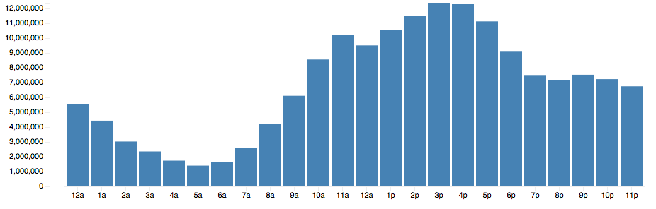

# Do programmers work at night?

Before I go on, we should discuss: Do programmers, in fact, work at night? Or is this just some myth perpetuated by male bravado and our romantic notions of someone working their magic until wee hours of the morning? Perhaps we just value exceptionally hard work, and what harder work is there than working through the night.

To research this book I talked to several programmers and read hundreds of comments on Twitter, various Reddit threads, and [my original essay](http://swizec.com/blog/why-programmers-work-at-night/swizec/3198). What I found is that yes, many programmers do work at night. In fact, those who do, are adamant that night is the best and only time to work.

But a large portion of the programmer population is also completely baffled by this. They claim that those who work at night fail at scheduling their lives properly, can't have familial obligations or just don't understand how spectacular starting your day in the morning can be.

Why the divide? It depends, but the core reasons for _why_ we favor night or day appear the same. They're when we can achieve deep thought, flow and focus on one's work.

Another avenue worth exploring is whether our perceptions of our own workflow match reality. For instance, I was certain that 1am was when I reached peak productivity and could get the most done. But looking at my commit timestamps on various projects shows that I am much less a night coder than I am a late afternoon and evening kind of guy.

## It depends

Programmers certainly _seem_ to work at night, according to the internet. You can find advice on stimulants, anecdotes of late night projects, and lots of boasting about how little sleep everyone needs.

But talking to individual programmers reveals it's not that simple. Many admit to mostly working during the day or late in the afternoon. They confess to only working at night when they have to meet a deadline.

The main lifestyle factors that affect day versus night appear to be:

 * Career: Are they freelancing or working a day job?
 * School: Are they a student of some sort?
 * Hobbies: Do they have pet projects?
 * Family: Do they have a spouse and/or children?

### Types of programmers

You can divide programmers roughly into two groups - independent programmers who set their own schedules, and those whose schedule is dictated by the organization they're in.

Those running a larger business fall into a grey area of sorts: Even though their schedule is their own to pick, they must still conform to the organization lest they hinder their employees' work. A common pattern is to work on management during the day and code during the night.

Different work patterns show up in each group.

Staffers are more likely to work during the day, mostly brought on by the needs of collaboration with others. Even working from home, they have to be available for Skype calls and must be relatively prompt in answering email and comments on various issue trackers. Despite living in the 21st century, physical presence at a common place of work is often still required.

After all, it's very difficult to collaborate when somebody is stuck on a bug at 11am and their colleague only answers email at 3am twice in a blue moon.

On the other hand, freelancers mostly dictate their own schedule. For many this is the reason they became freelancers in the first place.

It seems more likely for freelancers to work evenings and nights. Often, this isn't out of a preference for when they feel most productive, but out of guilt over how unproductive the day has been. Maybe there's just a lot of workaholics in this population, but talk to any freelancer for long enough and they will complain about how little they get done.

They get just as much done during the day as their employed counterparts, but they personally and financially _feel_ all the time  wasted on overhead.

Because much of their income is directly correlated to how much work they can get done, freelancers often push themselves into situations where the deadline or budget are just a smidge too tight. As soon as something goes wrong - and it always does - they are forced to chase deadlines.

### Age of programmers

Sleep researchers have discovered a link between circadian rhythms - our body's internal clock - and age. In a BBC documentary [The Secret Life of Your Body Clock](http://www.youtube.com/watch?v=uL97Ms6JUfQ) they performed an experiment on teenagers. Even though society forces them to learn in the morning, the experiment showed their brain activity is actually much better in the afternoon than it is in the morning.

Everybody starts life as a morning lark. Parents' anecdotes indicate that toddlers naturally wake up at 6am, no matter what.

But as we age, our cycle starts shifting more and more towards the night, hitting its nocturnal peak around the age of 21. It is therefore not surprising that teenagers and college students are known for "being lazy bums who sleep in all day".

At 21, our cycle starts shifting back into its "natural" state. By the time we reach our 65th birthday, we once more find the same affinity to early mornings as toddlers.

### How age correlates with lifestyle

Even more important than circadian rhythms, age is a good indicator of the relative lifestyles of programmers.

Few people have a family of their own at 22, while many do by the time they turn 40. This has a big effect on when people can code because it means juggling different priorities and obligations that get in the way of solving hard problems.

A lot of younger programmers work predominantly at night because they simply can't work during the day - there's classes to attend, schoolwork to finish. If they're very young and not working professionally yet, simply doing the chores their parents give them is more important than any coding they might have going on. 

So most of the coding happens at night - lovingly supported by their youthful circadian rhythms.

When a programmer gets old enough to code professionally, things change.  Programming becomes the most important thing in their lives (hopefully after friends and family), and they devote more time to it.

### Pet projects

Which brings us to pet projects.

Programming is the sort of job you can only do if you really love it. It really is kind of addicting and most people I know can't let it go even outside their work hours.

Yes, there are many programmers who love programming as a day job, but don't even want to look at code in their off time. But even those programmers will take on a pet project now and then. That inconspicuous bunch of code that's done just for fun.

Play is very important in creative professions. [Feynman once said](http://pythonwise.blogspot.com/2011/09/on-importance-of-playing.html) he became a bit disgusted with physics because too much was expected of him. So he started playing, completely without consequence. This led to his work on the spin of electrons for which he won a Nobel prize.

Having no obligations brings better work, solves more interesting challenges and refreshes the brain.

Not everybody is a famous researcher at a university, or a Google employee with company-mandated time to play, so they have to play when nobody is looking. And the only time nobody expects anything of them is at night or during weekends.  And so, fun projects happen _around_ "serious" work.

Pet projects can also act as social currency in the programmer community. The more your code helps others, the more respected you are. And when one night you make a cool hack that makes everyone's ears perk up, fuel is added to the myth of programmers who convert caffeine into amazing code.

## Statistics

[this needs to be expanded and pulled into a full blown section]

I created a small script that crawled Github search pages for about a week and collected a list of just over 500,000 Github repositories. Another small script then spent roughly fifteen hours going through this list and fetching each repository's punchcard.

As you might imagine, a punchcard tells us what time of day commits were made to a specific repository.

For instance, here's a punchcard for all the repositories that I own; you can get yours at [http://nightowls.swizec.com](http://nightowls.swizec.com).

To find out when programmers _actually_ work most, I collected all of this data into simple histogram - all 164,509,270 commits of it, or roughly 6 gigabytes. The results are interesting, although perhaps not surprising.

As you can see, most commits happen between 3pm and 5pm, just when a normal workday is concluding and people have to make sure all of their work is committed so they can go home for the day. This would imply that most programming still happens during normal working hours and that a lot of people use Github for work projects.

More interestingly, even though the volume of commits drops off dramatically - almost exponentially - after 3pm spike, it does not reach the very low volumes of early mornings. In fact, it remains at about 60% of peak volume for the remainder of the evening!

This is interesting on two fronts.

Firstly, it suggests that a lot of programming activity happens in the late afternoon and early night - for an industry that only works during working hours, commit volume at 9pm should be around the same as 5am. Practically zero that is.

Secondly, it's interesting that the volume remains so level until midnight and then start dropping dramatically until reaching the 5am low point, before it again starts rising in a bell curve towards the peak.

Unfortunately, my data does not allow me to tell which projects are things people work on in their spare time at home and which are purely work projects. A lot of interesting things could be gleaned from the data if I could figure that out. Right now I would say that our histogram hides two bell curves.

One bell curve has a peak at 3pm and the other at about 9pm, combining them together would produce the data we are looking at, I think. This warrants further study.

Keep in mind, even though peak commit volume is at the end of a normal working day, more than 5,000,000 commits in my dataset were made between midnight and 1am. That's a lot of programmers producing a lot of work.
